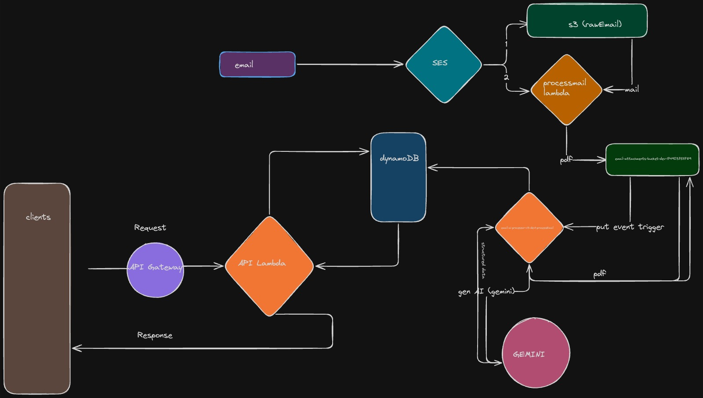

## For running backend 

cd backend 
serverless deploy

## For running frontend 

cd react-invoice-app
npm i
npm start

Lambda Functions :

processEmail - Its going to get trigger when are going to get the mail and its going to take the pdf from raw-email-bucket and store it to email-attachments-bucket-dev-1749037511789 bucket .

email-ai-processor-v3-dev1-custom-resource-existing-s3 - When a new pdf is getting store in email-attachments-bucket-dev-1749037511789 then this lambda is going to get trigeer and then its going to take the pdf and send it to Gemini from Gemini its going to recieve the structure data and then it will save it to dynamo db.

api-lambda - To get the details from the dynamo db and send the detail to client through api gateway 

S3 Buckets:
rawemail - To store email 
email-attachments-bucket-dev-1749037511789 - To store pdf 

Dynamo Db:
 ItemTable -  To store structure data coming from gemini

 OPEN AI :
 Gemini - To parse the pdf 

 SES :
 It will get trigger when it will recieve the mail
 

